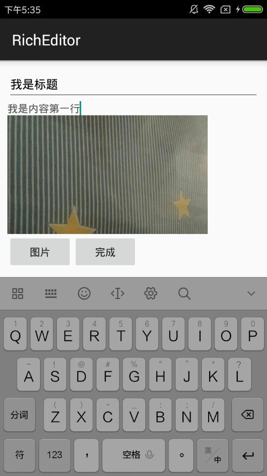
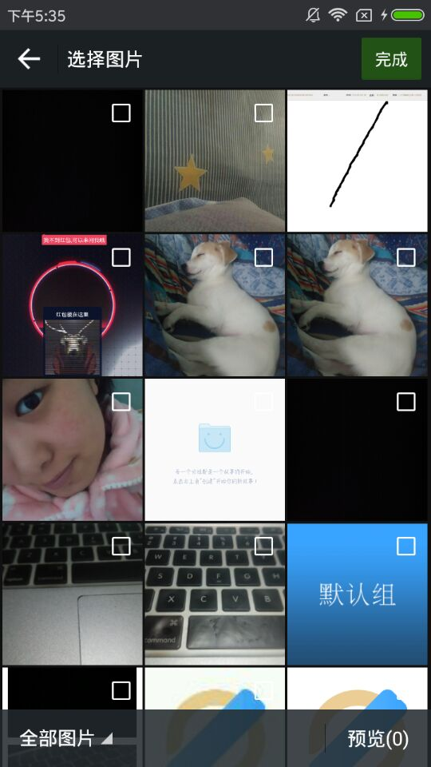
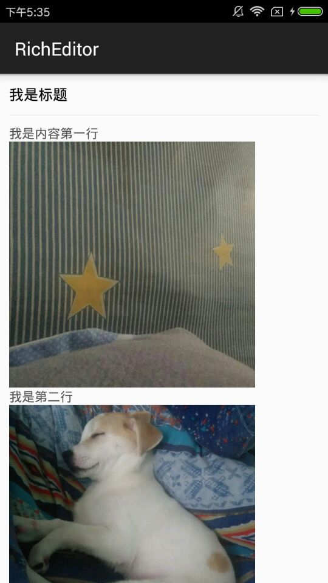

# RichEditor
 
利用RecyclerView实现的图文混排编辑！
先看图
##编辑

##选择图片

##预览最后效果

完全利用了RecyclerView来实现，没有任何自定义View（是不是感觉还可以？^_^）  
看下代码：  
####Adapter
完全标准的RecyclerView的Adapter，使用getItemViewType(int position)来区分标题和Item
  
```JAVA   
@Override
public int getItemViewType(int position) {
    if (position == 0) {
        return 0;//代表是标题
    }
    return 1;
}
```
当然，一般情况下有类型就意味着有不同的布局，so:
  
```JAVA   
@Override
public MyViewHolder onCreateViewHolder(ViewGroup parent, int viewType) {
    int layout;
    if (viewType == 0) {
        layout = R.layout.row_title;
    } else {
        layout = R.layout.row_item;
    }
    View view = LayoutInflater.from(parent.getContext()).inflate(layout, parent, false);
    return new MyViewHolder(view);
}
```
同样list的size要把标题加进去
```JAVA
@Override
public int getItemCount() {
    return list == null ? 1 : list.size() + 1;
}
```
剩下的就是绑定数据，position为0时时标题，剩下的要判断Item中的类型是图片还是文字（这里还有个小坑，就是list中EditText滑动复用的时候可能会把已有的值覆盖掉，具体解决方法看项目中的完整代码^_^）

```JAVA
@Override
public void onBindViewHolder(final MyViewHolder holder, final int position) {
    if (position == 0) {
        holder.etTitle.setText(title); 
    } else {
        if (list.get(position - 1).type.equals("0")) {
            holder.image.setVisibility(View.GONE);
            holder.etTxt.setVisibility(View.VISIBLE);
            
            holder.etTxt.setText(list.get(position - 1).txt);
         } else {
            holder.image.setVisibility(View.VISIBLE);
            holder.etTxt.setVisibility(View.GONE);
            
            LoaderImage.getInstance(0).ImageLoaders(list.get(position - 1).txt, holder.image);
        }
    }
}
```
是不是和平常写的Adapter没有区别？继续看Activity的代码，其实和普通的RecyclerView是一模一样的，  
关键是处理一下选择图片后返回时的一些逻辑：
>- 选择图片时，光标在Item的最前面
>- 选择图片时，光标在Item的最后面
>- 选择图片时，光标在Item的中间

```JAVA
@Override
protected void onActivityResult(int requestCode, int resultCode, Intent data) {
    super.onActivityResult(requestCode, resultCode, data);
    if (requestCode == 100 && resultCode == ImagePicker.RESULT_CODE_ITEMS && data != null) {
        // 选择的图片
        ArrayList<ImageItem> image = (ArrayList<ImageItem>) data.getSerializableExtra(ImagePicker.EXTRA_RESULT_ITEMS);
        // 这是选择图片时Item的一些信息
        String[] info = adapter.getInfo();
        String str = info[0];// 选择时的Item的值
        int index = Integer.parseInt(info[1]);// 选择时光标所在Item的位置
        int position = Integer.parseInt(info[2]);// Item的position

        if (index == 0) {// 光标在EditText最前
            list.add(position - 1, new MyBean("0", ""));// 先插入一条空白在图片的前面方便在图片前面再添加
            for (int i = 0; i < image.size(); i++) {// 循环添加图片+空白
                list.add(position + i * 2, new MyBean("1", image.get(i).path));
                if (i != image.size() - 1) {//最后一个没有，因为最后一张图片后面是插入之前的Item文字
                    list.add(position + (i * 2 + 1), new MyBean("0", ""));
                }
            }
        }else if (index == str.length()){// 光标在EditText最后
            for (int i = 0; i < image.size(); i++) {//在最后的话直接插入即可
                list.add(position + i * 2, new MyBean("1", image.get(i).path));
                list.add(position + (i * 2 + 1), new MyBean("0", ""));
            }
        } else {// 光标在EditText中间
        // 光标在中间的话，先删除当前Item，然后插入光标前的部分，再插入图片部分，再插入光标后的部分
            list.remove(position - 1);
            list.add(position - 1, new MyBean("0", str.substring(0, index)));

            for (int i = 0; i < image.size(); i++) {
                list.add(position + i * 2, new MyBean("1", image.get(i).path));
                if (i != image.size() - 1) {
                    list.add(position + (i * 2 + 1), new MyBean("0", ""));
                }
            }
            list.add(position + image.size() * 2 - 1, new MyBean("0", str.substring(index, str.length())));
        }
        adapter.notifyDataSetChanged();
    }
}
```
是不是很简单呢？还有一部分就图片的删除，这个没有提供，就是点击图片的时候把图片删除调，然后把图片前后的2个Item文字进行合并即可！完事大吉。。。